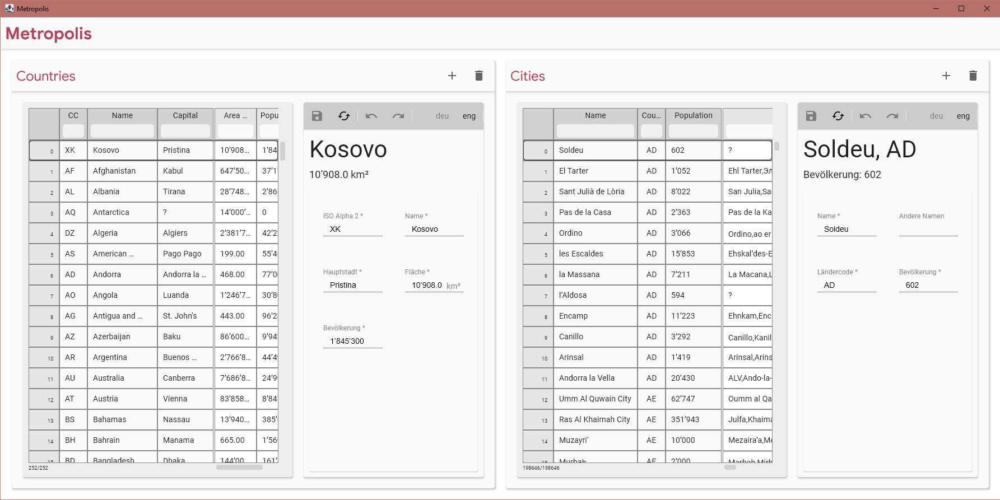

== Metropolis Manager
A student project as part of the module "Desktop application development" taught by Dr. Dieter Holz at the University of Applied Sciences Northwestern (FHNW)

=== Screenshot

//=== Demo
//video::Metropolis-Demo.mp4[]

Assignment description in German:

=== Die Aufgabe: Desktop Applikation zur Verwaltung von Städte-Informationen

Im Zentrum steht die Verwaltung von Gemeinden und Städten mit mehr als 500 Einwohnern. Weltweit sind dies ca. 200'000. Dafür ist die Entwicklung von mindestens zwei Explorern und zwei Editoren notwendig (jeweils für Städte und Länder).

Dieses Assignment entspricht einer typischen Situation, in der sich Software-Firmen häufig befinden. Es soll in sehr kurzer Zeit eine erste Version einer Geschäftsapplikation umgesetzt werden, die bereits eingesetzt werden kann und damit einen Nutzen beim Auftraggeber erzeugt. Auf dieser Basis wird dann ein längerfristiges Projekt definiert, bei dem die Geschäftsapplikation weiter optimiert wird.

Dementsprechend besteht das Assignment aus drei Teilen
[circle]
* _Entwurf_ der Applikation, so dass die Applikation _mit möglichst geringem Aufwand_ technisch umsetzbar ist. Normalerweise hat dieser Entwurf Schwächen im Bereich der Usability.
** Dieser Entwurf muss nicht weiter dokumentiert werden (kein Wireframe muss abgegeben werden)

* _Implementierung_ von `Metropolis`
** basierend auf den Beispielen und insbesondere den `xtracted`-Packages aus `module08` und `module09` ✔
** die beiden Explorer müssen LazyLoading, Sortieren und Filtern unterstützen ✔
** die Editoren unterstützen Mehrsprachigkeit, Input-Validierung und Undo/Redo ✔

* _Entwurf_ der _nächsten_ Applikations-Version (Balsamiq-Datei, .bmpr)
** Wie sieht das aus Benutzersicht optimale Interaktions-Konzept für `Metropolis 2.0` aus?
** Wie ist das optimale Zusammenspiel zwischen den beiden Explorern?
** Was soll passieren, wenn im `CountryExplorer` ein Land selektiert wird?
** Wann "erscheinen" die Editoren?
** Wie kann am besten bei einer Stadt das Land eingetragen werden?
** Wie kann die Datenkonsistenz sichergestellt werden, z.B. wenn bei einem Land die Hauptstadt eingetragen wird?
** Wann werden die Datenänderungen in einem Editor auch in den entsprechenden Explorern angezeigt?
** Wie wird visualisiert welche Datensätze verändert und noch nicht gespeichert wurden?
** dieser Teil der Aufgabe wird idealerweise in einem kleinen Team (zwei bis drei Personen) bearbeitet
** Dokumentieren Sie ihren Entwurf als Balsamiq-WireFrame

=== Anforderungen
[circle]
* Gewünschte Funktionalität
** 2 Explorer, jeweils mit Lazy-Loading aus der lokalen Datenbank `metropolisDB`, Sortier- und Filter-Möglichkeiten auf mindestens vier Spalten ✔
*** Implementierung basiert auf den Beispielen aus `module08` ✔
*** `CityExplorer` für die ca. 200'000 Städte und Gemeinden ✔
*** `CountryExplorer` für die ca. 250 Länder ✔
** 2 Editoren, jeweils mit Header-Bereich und Formular-Bereich ✔
*** Implementierung basiert auf den Beispielen aus `module09` ✔
*** `CityEditor` muss auf jeden Fall das Feld für den `COUNTRY_CODE` enthalten ✔
*** `CountryEditor` muss auf jeden Fall das Feld für `CAPITAL` enthalten ✔
** neue Städte/Länder können angelegt, bestehende aus der Datenbank gelöscht werden ✔
** die Explorer und Editoren müssen jeweils separat, mit einer eigenen Demo-Applikation gestartet werden können ✔
** `Metropolis` verbindet die Explorer und Editoren zu einer Gesamtapplikation ✔
*** Selektion einer Stadt im `CityExplorer` ✔
**** "öffnet" den `CityEditor` ✔
**** zeigt die Länder-Information in geeigneter Weise im `CountryExplorer`/`CountryEditor` an (✔)
*** Selektion eines Landes im `CountryExplorer`
**** öffnet den `CountryEditor` ✔
**** zeigt die Information der Hauptstadt in geeigneter Weise im `CityExplorer`/`CityEditor` an (✔)
**** zeigt die Städte dieses Landes in geeigneter Weise im `CityExplorer` an ✔
** _Wichtiger Hinweis_: Es sind Veränderungen und Erweiterungen in den `xtracted`-Packages notwendig. Diese können nicht unverändert übernommen werden. ✔
* Die Implementierungssprache für die gesamte Applikation ist Kotlin ✔
* Das UI ist mit Compose Desktop zu entwickeln ✔
* Verwendung von JDBC für die Datenbank-Zugriffe ✔
* Keine Verwendung von externen Libraries, die nicht bereits im Unterricht eingesetzt wurden ✔
